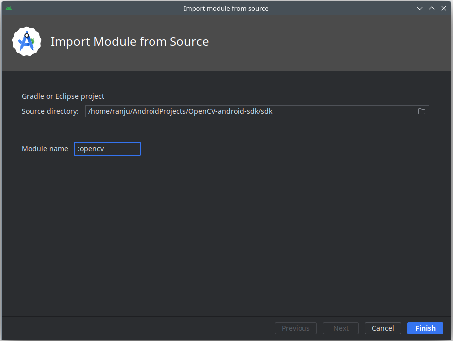

# OpenCV4.9-Android
Android Studio: Step-by-Step Guide for Setting up OpenCV SDK 4.9 on Android


The OpenCV Android SDK has undergone significant changes recently, rendering many existing guides outdated. This how-to guide aims to provide an up-to-date, step-by-step process for setting up the latest OpenCV SDK 4.9 in Android Studio for Android projects.
<br><br>

**Step 1: Download OpenCV SDK 4.9**

Download OpenCV Android SDK 4.9 from the Github repository (https://github.com/opencv/opencv/releases).


<br><br>

**Step 2: Extract the SDK**

After downloading, extract the SDK and place it in a convenient location. The folder structure should resemble the following after extraction.


<br><br>

**Step 3: Import OpenCV Module into Android Studio**

To import the OpenCV module into your Android project, navigate to File -> New -> Import Module.


Browse to the folder where you placed the extracted OpenCV SDK, select the "sdk" folder, provide a desired name for the module, and click "Finish." This action will import the OpenCV module into your Android project.



The module will be imported, but you may encounter Gradle build errors at this stage.


To resolve errors, switch from the Android pane to the Build log pane at the bottom of Android Studio. Click on the Build file (.../opencv/build.gradle) and make the necessary corrections marked in the screenshot. Finally, click the sync button to allow Gradle to sync the project.


<br><br>

**Step 4: Add the OpenCV Dependency**

Open your app-level build.gradle file and add the following line inside the "dependencies" block. Sync your project with Gradle by clicking the "Sync Now" button in Android Studio. Once the sync is completed, your Android project is now equipped with OpenCV.
```
implementation project(':opencv')
```


<br><br>

**Step 5: Load the OpenCV Library**

With the OpenCV module integrated, it's time to load the OpenCV library so that you can call OpenCV methods or functions from the app.

```java
package com.ranju.myapplication;

import androidx.appcompat.app.AppCompatActivity;

import android.graphics.Bitmap;
import android.graphics.BitmapFactory;
import android.os.Bundle;
import android.util.Log;

import org.opencv.android.OpenCVLoader;
import org.opencv.android.Utils;
import org.opencv.core.CvType;
import org.opencv.core.Mat;
import org.opencv.core.Size;
import org.opencv.imgproc.Imgproc;

import java.io.File;

public class MainActivity extends AppCompatActivity {

    // Replace with the actual path to your image file
    private static final String IMAGE_FILE_PATH = "/path/to/your/image.jpg";

    @Override
    protected void onCreate(Bundle savedInstanceState) {
        super.onCreate(savedInstanceState);
        setContentView(R.layout.activity_main);

        // Load OpenCV library
        if (OpenCVLoader.initLocal()) {
            Log.i("OpenCV", "OpenCV successfully loaded.");
        }

        // An example: Resize an image using OpenCV
        Bitmap bitmap = BitmapFactory.decodeFile(IMAGE_FILE_PATH);  // load the image

        if (bitmap != null) {
            Bitmap resizedBitmap = getResizedBitmapCV(bitmap, 400, 600);  // image resized using OpenCV

            // Other code goes here ...
        }
    }

    private Bitmap getResizedBitmapCV(Bitmap inputBitmap, int newWidth, int newHeight) {
        // Convert the input Bitmap to a Mat
        Mat inputMat = new Mat();
        Utils.bitmapToMat(inputBitmap, inputMat);

        // Create a new Mat for the resized image
        Mat resizedMat = new Mat();
        Imgproc.resize(inputMat, resizedMat, new Size(newWidth, newHeight));

        // Convert the resized Mat back to a Bitmap
        Bitmap resizedBitmap = Bitmap.createBitmap(newWidth, newHeight, Bitmap.Config.ARGB_8888);
        Utils.matToBitmap(resizedMat, resizedBitmap);

        inputMat.release();
        resizedMat.release();

        return resizedBitmap;
    }
}
```


***Congratulations!*** 

You've successfully navigated the steps to integrate the latest OpenCV SDK into your Android Studio project. Now, let the enchanting capabilities of OpenCV work their magic and elevate your projects to new heights. May your coding journey be filled with innovation and success!
